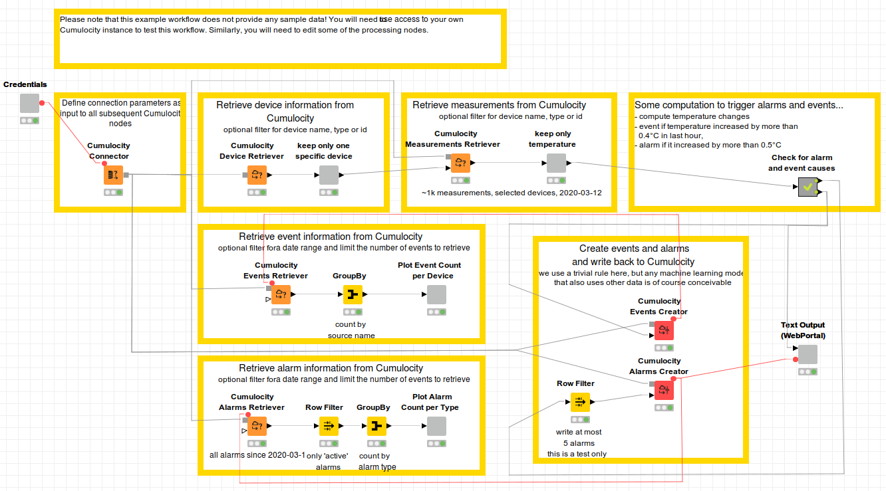

# Cumulocity / KNIME
## A bidrectional Connector from KNIME to the Cumulocity IoT Platform

The “Cumulocity Nodes” collection of nodes provides functionality to retrieve information about IoT devices, corresponding measurements, alarms and events from a given [Cumulocity IoT](https://www.softwareag.cloud/site/product/cumulocity-iot.html) platform instance. This data, possibly in combination with any other data, can be used to create new events and alarms within [KNIME](https://knime.org) and write them back to Cumulocity in order to trigger the corresponding actions within Cumulocity.

## Technical Details
The “Cumulocity Nodes” collection of nodes utilizes the [REST interface of Cumulocity](https://cumulocity.com/guides/reference/rest-implementation/). This implies the typically restrictions that come with REST interfaces hold here as well: it is not recommended to retrieve information about millions of devices or measurements at the same time and some requests may take a little bit longer than others...
We have already implemented a number of filters for some of the nodes that enable users to restrict the amount of data that is retrieved. Please feel free to use the feature request option (TODO link) if you need addtional filters.

## Features:
The following KNIME-nodes are currently available:

*  **Cumulocity Connector**: stores connection information in KNIME and creates the corresponding 'connection port' that can be used by subsequent nodes to call the REST interface of Cumulocity in order to GET and POST information.
*  **Cumulocity Device Retriever**: retrieves basic information (id, type, and name) about devices from Cumulocity.
*   **Cumulocity Measurements Retriever**: retrieves measurements from Cumulocity. Supported filters are: maximal number of measurements, date range and device ids.
*    **Cumulocity Measurements Creator**: writes measurements back to Cumulocity. This node has been implemented primarily for testing purposes. Measurements are typically created by devices and not programmatically.
*    **Cumulocity Events Retriever**: retrieves events from Cumulocity. Supported filters are: maximal number of events and date range.
*    **Cumulocity Events Creator**: write events back to Cumulocity.
*    **Cumulocity Alarms Retriever**: retrieves alarms from Cumulocity. Supported filters are: maximal number of alarms and date range.
*    **Cumulocity Alarms Creator**: writes alarms back to Cumulocity.

## Visualization
No specifc visualization has been implemented.

## Installation

You can install these nodes in KNIME 4.2 (?TODO) or above following these steps:

    in KNIME, open Help/Install new software
    Click top right button “Add”, and add the repository:
        name: “TODO”
        Location: http://update.knime.com/community-contributions/trunk
    After clicking ok, select this “TODO” entry in the combo box,
    Select the collection of nodes named “Cumulocity Nodes”
    Follow the next steps to install the Cumulocity extension nodes.

## Demo, examples
* [KNIME / Cumulocity Example Workflow](documentation/Cumulocity_IOT_Example.knwf)

## Copyright and License

Copyright (c) 2020 [tarent solutions GmbH](https://tarent.de). This program and the accompanying materials are made available under the terms of the GNU GENERAL PUBLIC LICENSE which accompanies this distribution, and is available at https://www.gnu.org/licenses/gpl-3.0.html

## Source code

The source code is shared in [GitHub](https://github.com/tarent/KNIME-Cumulocity-Connector). Contributions are warmly welcomed. Please report bugs, or feature requests, in the [GitHub bugtracker](https://github.com/tarent/KNIME-Cumulocity-Connector/issues/)
